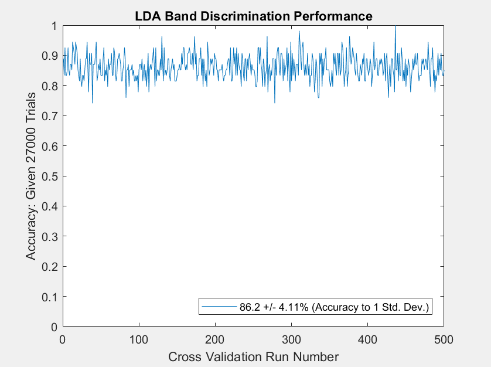

**Music Genre Identification: 
Spectrogram Creation, Analysis and Classification**
========================================

by J. Barhydt1

*University of Washington, Seattle, WA, 98195*

> **Overview:**

> **Machine learning techniques have become increasingly popular in data
> science throughout many fields, in both academia and industry. These
> 'pattern-recognition' methods allow for discrimination and
> classification of complex, disparate data types, with applications in
> economic modeling, speech recognition, n-body quantum system
> reconstruction, and more. This paper demonstrates a 'toy-model' for
> music band/genre classification using three machine learning methods,
> comparing performance of each.**

1- ?????This report uses http://vision.ucsd.edu/~iskwak/ExtYaleDatabase/ExtYaleB.html

- [Sec.   I. \| Introduction and Overview](#introduction-and-overview)
- [Sec.  II. \| Theoretical Background](#theoretical-background)
- [Sec. III. \| Algorithm Implementation and Development](#algorithm-implementation-and-development)
- [Sec.  IV. \| Computational Results](#computational-results)
- [Sec.   V. \| Summary and Conclusion](#summary-and-conclusions)
- [APPENDIX A\| MATLAB Functions Used](#appendix-a)
- [APPENDIX B\| MATLAB Code](#appendix-b)

# Introduction and Overview
==================================

Music classification is a task that humans can do quite naturally. After
acquiring a large enough 'training set' of bands, we are able to
discriminate between different bands and genres. The more music we hear,
the larger our training sets become, and the more able we are to
discriminate between sub-genres and niches musically, even when given
unknown new music, or 'test sets.' In order to discriminate between
types of music computationally, firstly a collection was assembled of
three musical genres, with three bands in each genre and sixteen songs
per band. Furthermore, from each song was taken three random 5-second
audio clips, for a total of 432 audio clips. A spectrogram, or windowed
Fourier transform, was constructed from each of the audio clips,
representing each in the frequency-time domain. These spectrograms
collectively formed the basis for the analysis and classification
methods performed. As such, three different classification tasks were
executed on the data, using three unique discrimination schemes. This
program and method could easily be extended to larger music collections,
though disk storage and memory space can be limiting factors, depending
on the sampling rate and spectrogram resolution, etc.

# Theoretical Background
==================================

Though many are familiar with amplitude-time representations of audio,
few could discriminate between two clips, or categorize genre/band/song
from the audio waveform alone. Shown in Figure 1 are two such clips.
Granted, the metal clip is clearly noisy but anyone would be hard
pressed to tell much more than that. Composers and performers of music
are much more familiar with frequency-time representations, such as
spectrograms. Figure 2 shows a spectrogram of the intro to Beethoven's
Fur Elise. Anyone with significant experience reading score would
recognize the similarity between the spectrogram and sheet music, and
with the proper conversion, could perform the piece from this type of
image. For those without experience reading sheet music, imagine instead
a spectrogram as being similar to an unrolled music box.

In this paper's analysis, it is the spectrograms which are used, instead
of the raw audio files. To generate the spectrograms, Fourier transforms
were applied. A Fourier transform projects the audio from amplitude-time
space onto the frequency domain, where it's decomposed into a linear
combination of frequencies. As this process eliminates time information,
'windowing' is implemented. A simple windowing scheme would 'chop' the
audio into

> 
> 

> **Figure 1. 5-second Raw Audio Clip of a Metal Band (above) and
> Beethoven (below).**

> 

> **Figure 2. 5-second Frequency-Time Spectrum of intro to Beethoven's Fur
> Elise. **

> **(notice the iconic 5-note left-hand arpeggio at the beginning)**

smaller clips, from which the Fourier transform can be executed on each
clip individually. In this paper, a slightly more sophisticated
windowing scheme is used, in which the window is not a hard boundary,
but rather a smooth, gaussian spread. The function weighs more heavily
the audio in the center of the gaussian, thus the function 'picks out' a
small zone with a short time interval from which to Fourier transform.
This process is referred to as a Gabor transform, which is a subtype of
short-time Fourier transforms. A visualization of this process is shown
in Figure 3.

Spectrograms are helpful in that they can contain both frequency and
time information simultaneously, though they suffer the same fate as
quantum mechanics vis-a-vis the Heisenberg Uncertainty Principle. In
other words, the better you resolve the audio in the frequency domain,
the less able you are to resolve in time, and vice-versa.

> 

> **Figure 3. Gabor transform: The raw audio is shown (above) with the
> Gaussian function overlayed. Each snapshot in time \-- from blue to
> red, etc\-- would produce a new, mostly attenuated audio signal
> (middle) which is subsequently Fourier Transformed (below) to retain
> the dominant high frequency components at that time.**

> 

> **Figure 4. Four Most Dominant Modes of 5 Clips from each Genre.**
>
> **(notice that mode 2 is quite unique for each genre)**

The spectrograms formed the basis for three discrimination techniques.
Figure 4 gives an underlying idea about how the spectrogram sets contain
such information; In the figure is shown the projections of all three
band spectrograms sets onto the SVD basis of the entire collection; in a
sense, each clip has its own 'fingerprint' and there are fingerprint
trends that all classical songs have. For instance, the second mode is
almost always around 0.1, which gives you an idea of how classification
could take place.

Ultimately, from each set, 5/8ths of the collected spectrograms were
used as training sets, leaving 3/8ths for testing. The training and test
sets were chosen at random for each permutation of the discrimination
techniques, to ensure cross-validation and provide statistics of
results. The three supervised discrimination/classification methods \--
along with a control method \-- were as follows:

Method 0: Control Group
-----------------------

For comparison, the control set simply made a random 'guess' of the
answer. Given that three answers were possible, ⅓ probability is
expected. As an aside: this method is clearly unsupervised, since it
doesn't do anything but guess numbers.

Method 1: Linear Discriminant Analysis (LDA)
--------------------------------------------

Given two classes of data, the intention of LDA is to find a basis with
the largest separation of class means, while minimizing inner-class
variances. As such, two covariance matrices represent these two
subjections. The variance from within a class \-- i.e. the elements from
which to form a diagonal basis \-- is given by Equation 1, where **x**
represents the collection of measurements for each item within a class,
while **μ** is the mean across all samples of that group. The squared
sum of these variances is given by **S**~w~. Subscripts denote each
class.

>  (1)

Furthermore, the cross variances, **S**~b~ , are given by Equation 2.
Ultimately, therefore the necessity to maximize cross variance,
maintaining the inner variances, becomes an optimization problem, which
is shown in Equation 3. In this implementation of the LDA scheme, the
optimization is achieved through solving the eigenvalue problem, given
by Equation 4. Thusly, a basis is constructed to separate the two
classes. A decision tree can perform this process several times for
higher class orders, if necessary. Ultimately, the test sets are
projected onto **ω,** as represented in Figure 5 and a weighted-mean
discriminant value provides a threshold for decisions.

>  (2)
>
> maximize
> 
> s.t.
>  (3)
>
>  (4)

Figure 6 further illustrates how the LDA projection is used for
classification, and how it looks with real data. The weighted center of
the projected sets determines the threshold, or decision line.

> 

> **Figure 5. Linear Discriminant Projection Cartoon (Kutz 442)**
>
> **(note that given the projection angle, data clusters can become mixed
> or separated)**

> 

> **Figure 6. Linear Discriminant Actualization, with Threshold Line**

Method 2: Naive Bayes Classification (NB)
-----------------------------------------

By assuming statistical independence between two data sets, the Naive
Bayes predictor assigns its classification based on the weighted
probability of its measurement, using gaussian variable distribution.
From the training set, this method forms a normal probability
distribution around an supervised (i.e. n-class solution known a-priori)
set of clusters. The methodology behind this classification scheme is
also the underpinnings of Statistical Mechanics systems.

For example, say there were two possible classes, or measurement
outcomes, C~1~ and C~2~. Via Bayes' theorem, we could calculate the
probability that some new data X belongs to C~1~ from Equation 5. the
values in the denominator are not known ahead of time, so instead of
solving for C~1~, we will consider the ratio of probabilities. Given
that the two systems are independent, the denominators will cancel,
leaving Equation 6, which is easily solvable. For ease, if you are
unfamiliar with the notation, P(C~1~\|X) is read as "the probability to
be in state C~1~ given some state X, which is precisely what we are
interested in. Also, if C~1~ and C~2~ are the same size, the P(C~1~) and
P(C~2~) terms will cancel.

>  (5)
>
>  (6)

> 

> **Figure 7. Classification Tree Visualization**
>
> **(notice that only 4 values are needed for classification: x1,x2,x4 and
> x5)**

Method 3: Classification & Regression Tree (CART)
-------------------------------------------------

Quite simply, a classification tree is a series of logical tests, which
fit the training set to known values. For instance, if I were to make a
quick classification tree based on Figure 6, I'd likely start by asking
"Is mode 2 positive?" If the answer is yes, I'd call it Classical.
Otherwise, I'd check some other variable. In many ways, this is similar
to the LDA threshold test, although with classification trees, the
process has many branch points. This type of process creates a very
accurate, albeit extremely overfit prediction model. Figure 7 shows a
classification tree visualization from the spectrogram data. Each
branching point represents another logical yes-or-no decision. It's like
a choose-your-own adventure book that hunts for music. This particular
trial was between three similar metal bands. As such, it's incredibly
impressive that the tree can often determine if a test band is \#3 with
a *single* number! (see: topmost decision node)

# Algorithm Implementation and Development
=====================================================

The file hierarchy sets up the solution sets to the training and test
group, and is scanned to build file path names and lists for each genre,
band, and song. Once these lists are built, the sgram program is run on
each song. Each instance of sgram takes in a single song name and
imports the song itself, choosing a random 5-second song clip. Since
some songs start and end with silence, the first 10 and last 30 seconds
of the song are not chosen. The program then uses the sample length and
framerate to downsample the clip, to reduce file size. A linear
time-base and frequency-base is built so that each spectrogram 'lives'
on a time-frequency grid. For the frequency base, the points (in
wavenumber basis) are given 2π/L separation, since the Fast-Fourier
Transform (FFT) assumes a 2π periodic signal, and L is the domain of
frequencies. The frequency basis is shifted, so that 0 Hz is centered.
At each time location, the Gaussian Gabor-function is multiplied by the
signal and FFT is performed, projecting from the amplitude-time domain
to amplitude-frequency space, creating the windowed-FFT at that time
snapshot, resulting in the complete spectrogram of that 5-second clip.
This process is performed on all songs, and saved for later recall with
a GENRE\_NAME.mat naming scheme, for classification.

Once the spectrograms are compiled, the analysis methods can be
performed. Each analysis follows the same essential structure. First,
the requisite data is compiled into a matrix, and an SVD is executed.
Since the data is in a known format, projections are extracted,
representing the 'fingerprints' of each data class. These fingerprints
are scrambled, and separated into training and test sets, and then each
set is concatenated. For instance, the fingerprints of the training set
are stacked next to one another, forming the full training set. These
full sets are run through the classification method (LDA, NB, CART), and
then a prediction is made of the class of the stacked test sets. An
EQUALS logic gate is applied between the sets, returning 0 for
false-guesses. Thus the ratio of the number of non-zeros to the size of
the set provides predictor accuracy. This process is repeated hundreds
of times. The mean and standard deviation of the results provides
cross-validation statistics of the method under scrutiny.

Pre-built MATLAB functions were used for NB and CART methods, while the
LDA method used a new function, LDA\_train, coupled with a simple
decision tree. To perform the two-species LDA, a spectrogram training
set for each band was loaded into the function. SVD of the set provided
a basis of fundamental modes for the test set to be projected onto
later. Following the process described in Section II, the necessary
variances were calculated, and covariant matrices were solved with the
pre-made MATLAB eigenvalue decomposition function. The eigenvectors were
truncated and formed the LDA basis, which was also applied to the test
set, after the SVD projection. To find the threshold line, the data sets
were sorted in magnitude, and the average of their crossing point
determined the threshold line value. Figure 6 also shows qualitatively
how this threshold line is achieved. Since a two-state LDA was performed
on each set of two bands, each data set is classified thrice through
LDA, from which the mode of each prediction is ultimately used. As an
aside, upgrading the LDA\_train method to handle more than two data sets
is not terribly complicated, and a quick internet search of the seminole
'Fisher Iris' dataset shows many ways to achieve this.

# Computational Results
=================================

Figure 8 shows the accuracy of each method after 500 iterations. All
three methods performs surprisingly well, regardless of whether genre or
band classification was the goal, as their accuracy error bars overlap.
The LDA and NB methods each predict to within mid 80% accuracy, with
slightly less variation than random guess. The regression tree predictor
however performs the best in both accuracy and variation, in that it
maintains half the standard deviation of the other two methods. This
means that any given run of the CART method will give consistent,
reliable results.

# Summary and Conclusions
==================================

Understanding music is a topic that is quintessentially human. At its
core however is some for of pattern recognition. These machine-learning
algorithms attempt to tease-out those patterns in order to make
classification predictions. The learning algorithm is limited however by
the scope of its training sets. For instance, if I were to classify a
funk band as metal, it would contribute to a bias in the metal training
set; a funky bias. Thus, future predictions of heavy funk songs could be
classified as metal.

Moreover, each spectrogram that was in the set merely had 20 points in
time, which would be akin to identifying an image that was 20 pixels
wide. Despite this, overall the methods were quite capable of
identifying between bands and genres. A larger number of time steps
would've created a better baseline, as would simply including more songs
by a given band, or more clips from each song. Furthermore, the songs
were heavily downsampled (5-10x) such that the audio clips themselves
were hardly distinguishable by ear. For instance, try listening to
8-11kHz sample rate audio, it sounds like an old, busted radio. By not
downsampling, better frequency resolution could've been achieved Each of
these additions however would add to the computational costs, though
once the SVD is performed on the spectrograms, the resulting dataset is
quite manageable in size.

As such, it would be easily to scale the system to much larger databases
and much richer spectrograms. It is hard to say if there would be a loss
in fidelity of the predictors, however the within-genre classification
still performed equally as well as the outside-genre trials. In other
words, the algorithm could just as easily predict whether a band was
classical or metal as it could distinguish between two very similar
metal bands.

Additionally, determining the Gabor function scaling value has a bit of
an art to it. A wider Gabor filter will include lower frequencies, and
contain more frequency information, though time resolution suffers,
conversely a very narrow Gabor filter will 'pluck out' few frequencies
and be highly resolved in time, though only short wavelengths will be
'seen' by the FFT. This issue leads to the use of wavelets, which choose
different window sizes for different areas on the spectrogram.
Short-time Wavelet Transforms were not used in this study, and could be
considered for future implementations.

> **Figure 8. Classification Performance Comparison w/ Mean & Std.
> Deviation Scores**

> **(Top Left: Random, Top Right: LDA, Bottom Left: NB, Bottom Right:
> CART)**

# APPENDIX A 
(MATLAB Functions Used / Description With Example)
=============================================================

**1)**

function \[spectrogram\] = sgram(song\_path,down\_rate,time\_steps,
gabor\_w)

\%This function accepts an audio file path in string format and performs
stft

\%analysis to create a random 5-second spectrogram matrix representing
both

\%time and frequency of the signal, using gaussian gabor windowing.

\% Arguments:

\%\-\-\-\-\-\-\-\-\-\-\-\-\-\-\-\-\-\-\-\-\-\-\-\-\-\-\-\--

\% song\_path: complete file path (if not in default MATLAB directory)

\% down\_rate: rate of audio downsampling (i.e. only collect one sample
per

\% \'down\_rate\' datapoints

\% time\_steps: number of points in time to run gabor window fft
algorithm

\% gabor\_w: arbitrary scaling value, corresponding to \"narrowness\" of
the

\% gabor window (gaussian) function

\% default arguments

if nargin \< 2

down\_rate = 10;

end

if nargin \< 3

time\_steps = 20;

end

if nargin \< 4

gabor\_w = 1000;

end

\% original read and data gather

\[y,Fs\] = audioread(song\_path);

song\_length = size(y,1)/Fs;

\% random sample location

sample\_start = 30 + rand()\*(song\_length-10-30);

fin = sample\_start + 5 ; %could change smaple length here

L = fin - sample\_start;

\% determine sample location

samples = \[round(sample\_start\*Fs),round(fin\*Fs-1)\];

clear y Fs

\% only read sample clip

\[y,Fs\] = audioread(song\_path,samples);

\%downsample rate

r=down\_rate;

audio=downsample(y(:,1)\',r);

n=round(L\*Fs/r);

\% build timebase

t2=linspace(0,L,n+1); t=t2(1:n);

\% build frequency base (2\*pi periodic) and center-shift (0 at origin)

k=(2\*pi/L)\*\[0:n/2-1 -n/2:-1\]; ks=fftshift(k);

\% set gabor window slide location

tslide=linspace(0,L,time\_steps);

\% initialize spectrogram

spectrogram=zeros(time\_steps,length(t));

for j=1:time\_steps

gabor=exp(-gabor\_w\*(t-tslide(j)).\^2); %gabor expresssion at slide loc

Sg=gabor.\*audio; windowed\_fft=fft(Sg); %Gabor-Signal FFT

spectrogram(j,:)=abs(fftshift(windowed\_fft)); %spectrogram (let -k=k)

end

**2)**

function \[proj,U,w,thresh\_line\] = LDA\_train(band1,band2,num\_modes)

\%This function was designed to accept two bands\' spectrogram sets and

\%truncation rank, to perform LDA.

\% Arguments:

\%\-\-\-\-\-\-\-\-\-\-\-\-\-\-\-\-\-\-\-\-\-\-\-\-\-\-\-\--

\% band1: vectorized grouping of training set for band\#1

\% band2: vectorized grouping of training set for band\#2

\% num\_modes: number of LDA features to keep after projection

\%

\%

\% Returns:

\%\-\-\-\-\-\-\-\-\-\-\-\-\-\-\-\-\-\-\-\-\-\-\-\-\-\-\-\--

\% proj: projection vector of bands onto LDA basis

\% U: truncated (by num\_modes) SVD basis modes. Use U\'\*test to

\% create test set SVD projection.

\% w: truncated LDA feature space. Use w\'\*U\'\*test to project test

\% set onto LDA basis for discrimination.

\% thresh\_line: descriminator value

\% default arguments

if nargin \< 3

num\_modes = 1;

end

\%band bundling

num\_1=size(band1,2);num\_2=size(band2,2);

band\_concat=\[band1,band2\];

\[U,S,V\]=svd(band\_concat,\'econ\');

\%bands=S\*V\'; %band features in svd basis

U = U(:,1:num\_modes);

band1\_group = bands(1:num\_modes,1:num\_1);

band2\_group = bands(1:num\_modes,num\_1+1:num\_1+num\_2);

u1=mean(band1\_group,2);u2=mean(band2\_group,2);

\%cross variances

s\_between=(u2-u1)\*(u2-u1)\';

\%diagonal 'inner' variances

s\_within=0;

for i=1:num\_1

variance = (band1\_group(:,i)-u1);

s\_within=s\_within+variance\*variance\';

end

for i=1:num\_2

variance = (band2\_group(:,i)-u2);

s\_within=s\_within+variance\*variance\';

end

\[V2,D\]=eig(s\_between,Sw); %LDA

\[\~,trunc\]=max(abs(diag(D))); %feature truncation

w=V2(:,trunc)/norm(V2(:,trunc)); %normal to diagonalized space

\% band projections onto LDA

vband1= w\'\*band1\_group; vband2= w\'\*band2\_group;

proj=\[vband1, vband2\];

\% linear sorting by midpoint

if mean(vband1)\>mean(vband2)

w=-w;vband1=-vband1;vband2=-vband2;

end

band1\_dec=sort(vband1);

band2\_dec=sort(vband2);

t1=length(band1\_dec);t2=1;

while band1\_dec(t1)\>band2\_dec(t2)

t1=t1-1; %dec t1

t2=t2+1; %inc t2

end

thresh\_line=(band1\_dec(t1)+band2\_dec(t2))/2;

end

**3)**

function \[y,Fs\] = musicclip(song\_path,clip\_length,r)

\%This function accepts an audio file path in string format and creates
a

\%randomly located clip from the audio file, whose length and sample
rate

\%can be chosen.

\% Arguments:

\%\-\-\-\-\-\-\-\-\-\-\-\-\-\-\-\-\-\-\-\-\-\-\-\-\-\-\-\--

\% song\_path: complete file path (if not in default MATLAB directory)

\% r: rate of audio downsampling (i.e. only collect one sample per

\% \'down\_rate\' datapoints

\% clip\_length: length, in seconds, of the audio clip to be returned

\%

\% Returns:

\%\-\-\-\-\-\-\-\-\-\-\-\-\-\-\-\-\-\-\-\-\-\-\-\-\-\-\-\--

\% y: down-sampled, audio clip of desired length

\% Fs: clip frame-rate

\% default arguments

if nargin \< 2

clip\_length = 5;

end

if nargin \< 3

r = 1;

end

\[y,Fs\] = audioread(song\_path);

song\_length = size(y,1)/Fs;

sample\_start = 30 + rand()\*(song\_length-10-30);

fin = sample\_start + clip\_length ;

samples = \[round(sample\_start\*Fs),round(fin\*Fs-1)\];

clear y Fs

\[y,Fs\] = audioread(song\_path,samples);

y = (y(:,1)+y(:,2))/2;

y=downsample(y(:,1)\',r);

end

# APPENDIX B 
(MATLAB Code)
========================

\% Music Genre Identification: Spectrogram Analysis, Classification

\% Johnathon R Barhydt

\% AMATH 482 HW3

\%\-\-\-\-\-\-\-\-\-\-\-\-\-\-\-\-\-\-\-\-\-\-\-\-\-\-\-\-\-\-\-\-\-\-\-\-\-\-\-\-\-\-\-\-\-\-\-\-\-\-\-\-\-\-\-\-\-\-\-\-\-\-\-\-\-\-\-\-\-\-\-\-\--

\% To get quality spectrograms, tune up the inputs to sgram, default
will

\% be quick. Currently file hierarchy must be maintained, and each band

\% is to have equal number of songs. This can be easily changed.

\%

\% specs for this run:

\% 3 5sec clips per song

\% 16 songs per band

\% 3 bands per genre

\% 3 genres

\%\-\-\-\-\-\-\-\-\-\-\-\-\-\-\-\--

\% total of 432 clips

\%

clear all; close all; clc

\% root music directory, must have genre\>band\>song substructure

directory=\'C:\\\\Music\';

\% projection rank, number of spectrogram basis modes in discrimination

rank=5;

\% num x-validation iterations

perms=500;

\% generate genre lists / band lists / song lists

main\_dir=dir(directory);

\% build genre list

genre\_list=strings(length(main\_dir)-2,1);

for i=1:length(genre\_list)

genre\_list(i)=string( main\_dir(i+2).name);

end

\% build band list

for g=1:length(genre\_list)

genre\_dir\_path= char(strcat(directory,\"\\\",genre\_list( g )));

genre\_dir=dir(genre\_dir\_path);

band\_list=strings( length( genre\_dir)-2, 1);

for i=1:length(band\_list)

band\_list(i)=string( genre\_dir( i+2).name);

end

\% build song list

for b=1:length(genre\_list)

band\_dir\_path = char(strcat(directory,\"\\\",genre\_list( g
),\"\\\",band\_list( b )));

band\_dir=dir(band\_dir\_path);

song\_list=strings( length( band\_dir)-2, 1);

for i=1:length(song\_list)

song\_list(i)=string( band\_dir( i+2).name);

end

\% generates spectrograms of each song clip (CAN BE VERY COSTLY!)

for s=1:length(song\_list)

song\_path = char(strcat(directory,\"\\\",genre\_list( g
),\"\\\",band\_list( b ),\"\\\",song\_list( s )));

\% sgram(downsample\_rate,number\_timesteps,gab\_window\_narrowness\"

sg1(:,:,s)=sgram(song\_path, 10, 20, 1000);

sg2(:,:,s)=sgram(song\_path, 10, 20, 1000);

sg3(:,:,s)=sgram(song\_path, 10, 20, 1000);

end

\% export spectrograms as Genre\_BandName.mat

filename = strcat(genre\_list(g),\'\_\',band\_list(b),\'.mat\');

\% collect sgrams

sg = cat(3,sg1,sg2,sg3);

save(filename, \'sg\');

end

end

\%\-\-\-\-\-\-\-\-\-\-\-\-\-\-\-\-\-\-\-\-\-\-\-\-\-\-\-\-\-\-\-\-\-\-\-\-\-\-\-\-\-\-\-\-\-\-\-\-\-\-\-\-\-\-\-\-\-\-\-\-\-\-\-\-\-\-\-\-\-\-\-\-\--

\%% Load Saved Spectrograms For Analysis, this would be simplified
outside of a 'toy model'

\%

A=importdata(\'Classical\_Beethoven.mat\');

sp\_w=size(A,1);sp\_h=size(A,2);

for i=1:size(A,3)

beeth(:,i)=reshape(A(:,:,i),sp\_w\*sp\_h,1);

end

A=importdata(\'Classical\_Mozart.mat\');

for i=1:size(A,3)

mozrt(:,i)=reshape(A(:,:,i),sp\_w\*sp\_h,1);

end

A=importdata(\'Classical\_Tchaikovsky.mat\');

for i=1:size(A,3)

tchai(:,i)=reshape(A(:,:,i),sp\_w\*sp\_h,1);

end

A=importdata(\'Funk\_EWF.mat\');

for i=1:size(A,3)

earth(:,i)=reshape(A(:,:,i),sp\_w\*sp\_h,1);

end

A=importdata(\'Funk\_Funkadelic.mat\');

for i=1:size(A,3)

delic(:,i)=reshape(A(:,:,i),sp\_w\*sp\_h,1);

end

A=importdata(\'Funk\_Sly.mat\');

for i=1:size(A,3)

stone(:,i)=reshape(A(:,:,i),sp\_w\*sp\_h,1);

end

A=importdata(\'Metal\_Bodom.mat\');

for i=1:size(A,3)

bodom(:,i)=reshape(A(:,:,i),sp\_w\*sp\_h,1);

end

A=importdata(\'Metal\_Necrophagist.mat\');

for i=1:size(A,3)

necro(:,i)=reshape(A(:,:,i),sp\_w\*sp\_h,1);

end

A=importdata(\'Metal\_Nile.mat\');

for i=1:size(A,3)

nile(:,i)=reshape(A(:,:,i),sp\_w\*sp\_h,1);

end

clear A;

\%\-\-\-\-\-\-\-\-\-\-\-\-\-\-\-\-\-\-\-\-\-\-\-\-\-\-\-\-\-\-\-\-\-\-\-\-\-\-\-\-\-\-\-\-\-\-\-\-\-\-\-\-\-\-\-\-\-\-\-\-\-\-\-\-\-\-\-\-\-\-\-\-\--

\%% (test 0) Random Guess

\% for any three choices, there\'s a 33% chance to get an answer right.

\% solutions

test\_sol= \[zeros(1,18),1\*ones(1,18),2\*ones(1,18)\]\';

for i=1:perms

rand\_accuracy(i)=nnz((test\_sol==randi(\[0
2\],1,54)\'))/length(test\_sol);

end

\% cross validation result statistics

u\_accuracy=round(100\*mean(rand\_accuracy),1);

s\_accuracy=round(100\*std(rand\_accuracy),2);

result = strcat(num2str(u\_accuracy),\" +/- \",num2str(s\_accuracy),\"%
(Accuracy to 1 Std. Dev.)\");

plot(rand\_accuracy), set(gca,\'Ylim\',\[0,1\]),
legend(result,\'Location\',\'southeast\')

title(\'Random Band Discrimination Performance\')

ylabel(strcat(\"Accuracy: Given \",num2str(length(test\_sol)\*perms),\"
Trials\"))

xlabel(\'Cross Validation Run Number\')

\%\-\-\-\-\-\-\-\-\-\-\-\-\-\-\-\-\-\-\-\-\-\-\-\-\-\-\-\-\-\-\-\-\-\-\-\-\-\-\-\-\-\-\-\-\-\-\-\-\-\-\-\-\-\-\-\-\-\-\-\-\-\-\-\-\-\-\-\-\-\-\-\-\--

\%% (test 1) Band Classification:

\% From unused 5-second clips, determine if band is:

\% Beethoven, Children of Bodom, or Sly & the Family Stone

\% using full rank linear projection discrimination

\%

data =\[beeth bodom stone\];

\% decompose data

\[u,s,v\]=svd(data,\'econ\');

\% grab band \'fingerprints\', up to a given feature mode rank

vbeeth=v(1:48,1:rank);

vbodom=v(49:96,1:rank);

vstone=v(97:end,1:rank);

\% cross validation of training/test

for i=1:perms

\% scramble data for train/test sets

perm1=randperm(size(beeth,2));

perm2=randperm(size(bodom,2));

perm3=randperm(size(stone,2));

\% traning set

train\_set=\[ vbeeth(perm1(1:30),:);\...

vbodom(perm2(1:30),:);\...

vstone(perm3(1:30),:)\];

\% test set

test\_set= \[ vbeeth(perm1(31:end),:);\...

vbodom(perm2(31:end),:);\...

vstone(perm3(31:end),:)\];

\% ground truth (0=beethoven, 1=bodom, 2=sly & the family stone)

sol\_set = \[zeros(1,30),1\*ones(1,30),2\*ones(1,30)\]\';

test\_sol= \[zeros(1,18),1\*ones(1,18),2\*ones(1,18)\]\';

\% LDA decision tree

\[\~,U,w,bm\_line\]=LDA\_train(train\_set(1:30,:)\',train\_set(31:60,:)\',rank);

test\_SVD=U\'\*test\_set\';

test\_LDA=w\'\*test\_SVD;

beet\_v\_bodom=(test\_LDA\>bm\_line); %0 for beethoven, 1 for bodom

\[\~,U,w,bs\_line\]=LDA\_train(train\_set(1:30,:)\',train\_set(61:90,:)\',rank);

test\_SVD=U\'\*test\_set\';

test\_LDA=w\'\*test\_SVD;

beet\_v\_sly=2\*(test\_LDA\>bs\_line); %0 for beethoven, 2 for sly & tfs

\[\~,U,w,ms\_line\]=LDA\_train(train\_set(31:60,:)\',train\_set(61:90,:)\',rank);

test\_SVD=U\'\*test\_set\';

test\_LDA=w\'\*test\_SVD;

bodom\_v\_sly=1+(test\_LDA\>ms\_line); %1 for bodom, 2 for sly & tfs

\% results: each entry corresponds to a spectrogram column

\% 0=beethoven 1=bodom 2=sly & the family stone

results=(mode(\[beet\_v\_bodom;beet\_v\_sly;bodom\_v\_sly\]));

results=(test\_sol==results\');

accuracy(i)=nnz(results)/length(results);

end

\% cross validation result statistics

u\_accuracy=round(100\*mean(accuracy),1);

s\_accuracy=round(100\*std(accuracy),2);

result = strcat(num2str(u\_accuracy),\" +/- \",num2str(s\_accuracy),\"%
(Accuracy to 1 Std. Dev.)\");

plot(accuracy), set(gca,\'Ylim\',\[0,1\]),
legend(result,\'Location\',\'southeast\')

title(\'LDA Band Discrimination Performance\')

ylabel(strcat(\"Accuracy: Given \",num2str(length(test\_sol)\*perms),\"
Trials\"))

xlabel(\'Cross Validation Run Number\')

\%\-\-\-\-\-\-\-\-\-\-\-\-\-\-\-\-\-\-\-\-\-\-\-\-\-\-\-\-\-\-\-\-\-\-\-\-\-\-\-\-\-\-\-\-\-\-\-\-\-\-\-\-\-\-\-\-\-\-\-\-\-\-\-\-\-\-\-\-\-\-\-\-\--

\%% (test 2) Classification Within Genre:

\% From unused 5-second clips, determine if band is:

\% Nile, Children of Bodom, or Necrophagist

\% using naive Bayesian discrimination

data =\[bodom necro nile\];

\% decompose data

\[u,s,v\]=svd(data,\'econ\');

\% grab band \'fingerprints\', up to a given feature mode rank

vbodom=v(1:48,1:rank);

vnecro=v(49:96,1:rank);

vnile= v(97:end,1:rank);

\% cross validation of training/test

for i=1:perms

\% scramble data for train/test sets

perm1=randperm(size(bodom,2));

perm2=randperm(size(necro,2));

perm3=randperm(size(nile ,2));

\% traning set

train\_set=\[ vbodom(perm1(1:30),:);\...

vnecro(perm2(1:30),:);\...

vnile(perm3(1:30),:)\];

\% test set

test\_set= \[ vbodom(perm1(31:end),:);\...

vnecro(perm2(31:end),:);\...

vnile(perm3(31:end),:)\];

\% ground truth (1=bodom, 2=necro, 3=nile)

sol\_set = \[ones(1,30),2\*ones(1,30),3\*ones(1,30)\]\';

test\_sol= \[ones(1,18),2\*ones(1,18),3\*ones(1,18)\]\';

\% run naive bayes ppredictor

nb=fitcnb(train\_set,sol\_set);

predict=nb.predict(test\_set);

\% use logic against solution set for accuracy

result=(predict==test\_sol);

accuracy(i)=nnz(result)/length(result);

end

\% cross validation result statistics

u\_accuracy=round(100\*mean(accuracy),1);

s\_accuracy=round(100\*std(accuracy),2);

result = strcat(num2str(u\_accuracy),\" +/- \",num2str(s\_accuracy),\...

\"% (Accuracy to 1 Std. Dev.)\");

\% cross validation visual

plot(accuracy)

set(gca,\'Ylim\',\[0,1\])

legend(result,\'Location\',\'southeast\')

title(\'Naive Bayes Band Discrimination Performance\')

ylabel(strcat(\"Accuracy: Given \",num2str(length(test\_sol)\*perms),\"
Trials\"))

xlabel(\'Cross Validation Run Number\')

\%\-\-\-\-\-\-\-\-\-\-\-\-\-\-\-\-\-\-\-\-\-\-\-\-\-\-\-\-\-\-\-\-\-\-\-\-\-\-\-\-\-\-\-\-\-\-\-\-\-\-\-\-\-\-\-\-\-\-\-\-\-\-\-\-\-\-\-\-\-\-\-\-\--

\%% (test 3) Genre Classification:

\% from 5-second clips of new bands, determine if genre is:

\% Classical, Metal, or Funk

\% using classification-and-regression-tree (CART) discrimination

data =\[beeth mozrt tchai earth delic stone bodom necro nile\];

\% decompose data

\[u,s,v\]=svd(data,\'econ\'); clear data;

\% grab genre \'fingerprints\', up to a given feature mode rank

rank=5; %\<\-\-\--don\'t need many modes for decision tree to be
accurate

vclas=v(1:144,1:rank);

vfunk=v(145:288,1:rank);

vmetl=v(289:end,1:rank);

\% cross validation of training/test

for i=1:perms

\% scramble data for train/test sets

perm1=randperm(size(vclas,1));

perm2=randperm(size(vfunk,1));

perm3=randperm(size(vmetl,1));

\% traning set

train\_set=\[ vclas(perm1(1:90),:);\...

vfunk(perm2(1:90),:);\...

vmetl(perm3(1:90),:)\];

\% test set

test\_set= \[ vclas(perm1(91:end),:);\...

vfunk(perm2(91:end),:);\...

vmetl(perm3(91:end),:)\];

\% ground truth (1=classic, 2=funk, 3=metal)

sol\_set = \[ones(1,90),2\*ones(1,90),3\*ones(1,90)\]\';

test\_sol= \[ones(1,54),2\*ones(1,54),3\*ones(1,54)\]\';

\% run naive bayes predictor

tree=fitctree(train\_set,sol\_set);

predict=tree.predict(test\_set);

\% use logic against solution set for accuracy

result=(predict==test\_sol);

accuracy(i)=nnz(result)/length(result);

end

\% cross validation result statistics

u\_accuracy=round(100\*mean(accuracy),1);

s\_accuracy=round(100\*std(accuracy),2);

result = strcat(num2str(u\_accuracy),\" +/- \",num2str(s\_accuracy),\...

\"% (Accuracy to 1 Std. Dev.)\");

\% cross validation visual

plot(accuracy)

set(gca,\'Ylim\',\[0,1\])

legend(result,\'Location\',\'southeast\')

title(\'Regression-Tree Genre Discrimination Performance\')

ylabel(strcat(\"Accuracy: Given \",num2str(length(test\_sol)\*perms),\"
Trials\"))

xlabel(\'Cross Validation Run Number\')
